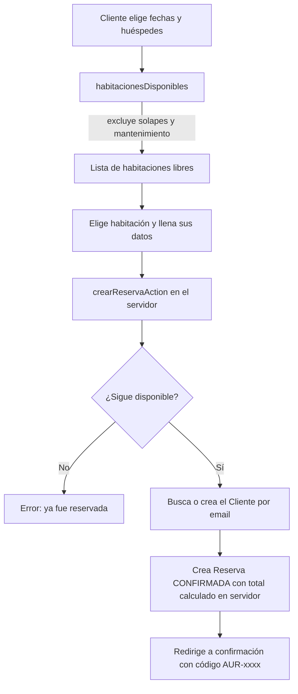
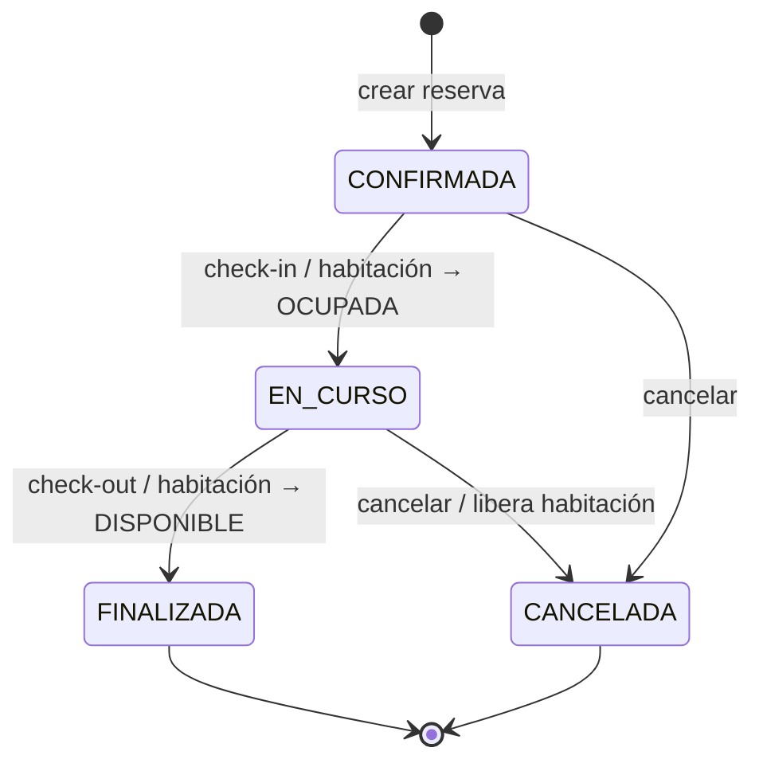
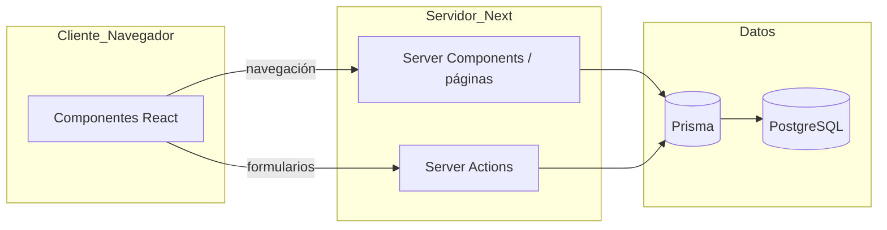

# 📐 Diagramas — Hotel Aurora

Diagramas de diseño que muestran cómo pensamos el flujo y la arquitectura antes y durante
la construcción. (GitHub los renderiza automáticamente.)

---

## 1. Flujo de una reserva (cliente)

---

## 2. Ciclo de vida de la reserva (máquina de estados)

Las transiciones se validan: solo se hace check-in a una reserva `CONFIRMADA` y check-out a
una `EN_CURSO`. Implementado en `src/app/actions/reservas.ts`.

---

## 3. Arquitectura por capas

- **Server Components/páginas** leen datos (consultas Prisma).
- **Server Actions** escriben (crear/actualizar/eliminar) y revalidan la vista.
- **Prisma** traduce a SQL sobre **PostgreSQL**.

---

## 4. Matriz de roles y permisos

| Acción | Cliente | Recepción (PERSONAL) | Administrador (ADMIN) |
|--------|:------:|:--------------------:|:---------------------:|
| Buscar y reservar (sitio público) | ✅ | ✅ | ✅ |
| Entrar al panel | ❌ | ✅ | ✅ |
| Check-in / check-out / cancelar | ❌ | ✅ | ✅ |
| Registrar/editar clientes | ❌ | ✅ | ✅ |
| Cambiar estado de habitación | ❌ | ✅ | ✅ |
| **Crear / eliminar habitaciones** | ❌ | ❌ | ✅ |
| **Eliminar clientes** | ❌ | ❌ | ✅ |

La restricción de las dos últimas filas se aplica **en el servidor** (Server Actions) y
además se oculta en la interfaz.
