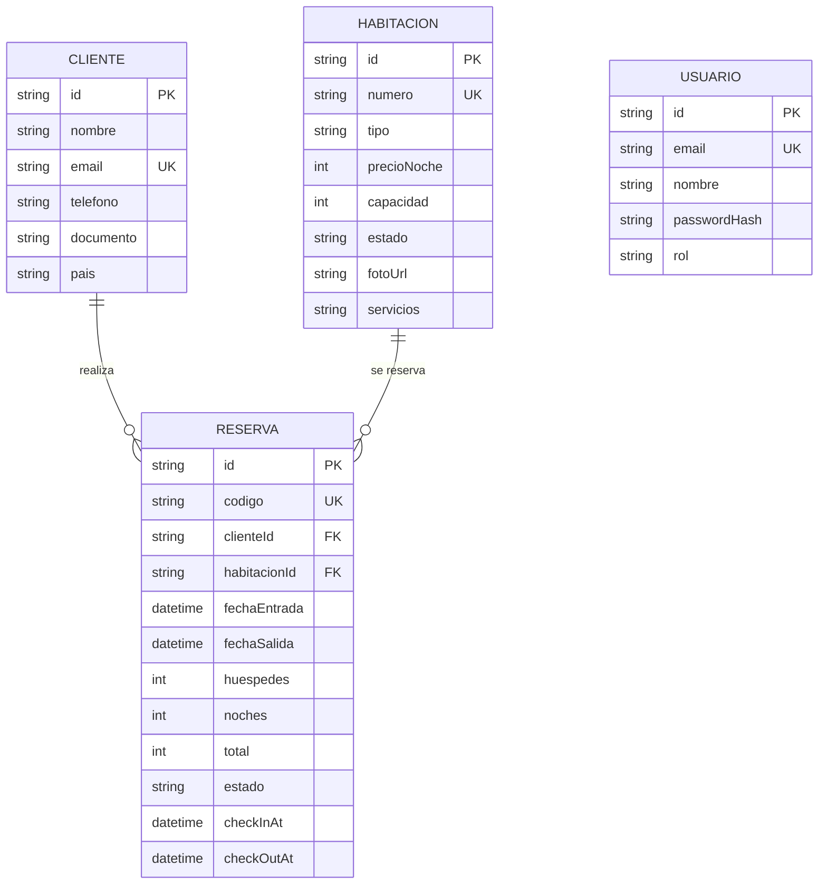

# 🗂️ Modelo de datos — Hotel Aurora

Diseño de la base de datos **pensado a propósito** alrededor del concepto de
**datos maestros** (catálogo que se administra) y **datos transaccionales** (operaciones).

## Diagrama Entidad–Relación



## ¿Por qué este diseño?

| Entidad | Clasificación | Justificación |
|---------|---------------|---------------|
| `Habitacion` | **Maestro** | Catálogo del hotel; se da de alta/baja y cambia poco |
| `Cliente` | **Maestro** | Registro de huéspedes; se reutiliza entre reservas (se busca por `email`) |
| `Reserva` | **Transaccional** | Operación que ocurre muchas veces; relaciona cliente↔habitación y cambia de estado |
| `Usuario` | Soporte | Personal del hotel para login; separado del Cliente a propósito |

**Decisiones de modelado:**
- `Cliente.email` y `Habitacion.numero` son **únicos** → evitan duplicados.
- La `Reserva` **guarda** `noches`, `total` y `codigo` (no se recalculan después) → el
  histórico queda fijo aunque cambie el precio de la habitación.
- Los **estados** se modelan como texto controlado (enum lógico), no como booleanos sueltos,
  para representar correctamente el ciclo de vida.

## Estados (invariantes del dominio)
- `Habitacion.estado`: `DISPONIBLE | OCUPADA | MANTENIMIENTO`
- `Reserva.estado`: `CONFIRMADA | EN_CURSO | FINALIZADA | CANCELADA`

## Regla de integridad central (RNF1)
Una habitación **no** puede tener dos reservas activas con fechas solapadas. Solape:
```
reservaExistente.entrada < nueva.salida  Y  reservaExistente.salida > nueva.entrada
```
Se valida en `src/lib/availability.ts` y se **re-verifica** al crear la reserva
(`src/app/actions/reservas.ts`). Ver diagramas en [`DIAGRAMAS.md`](DIAGRAMAS.md).
